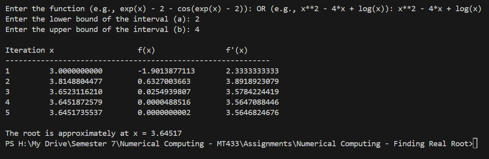
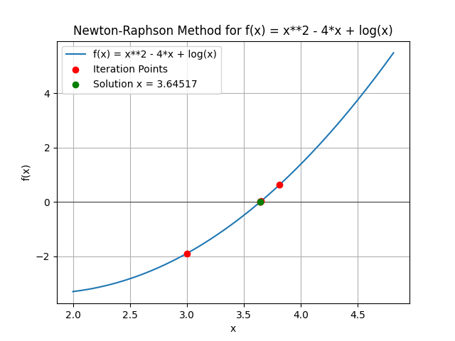
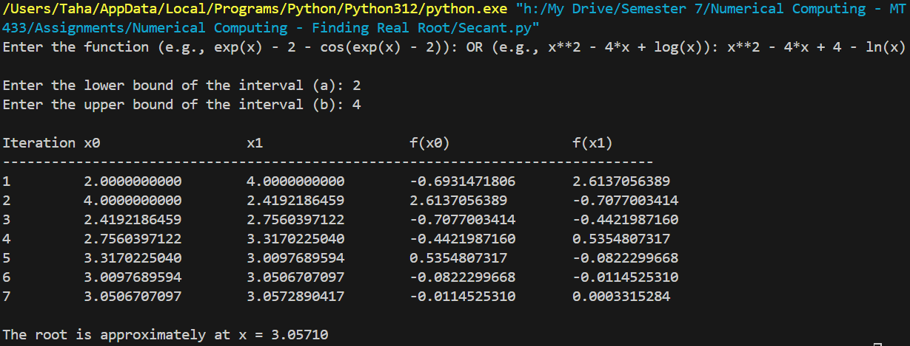
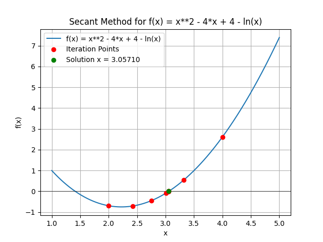
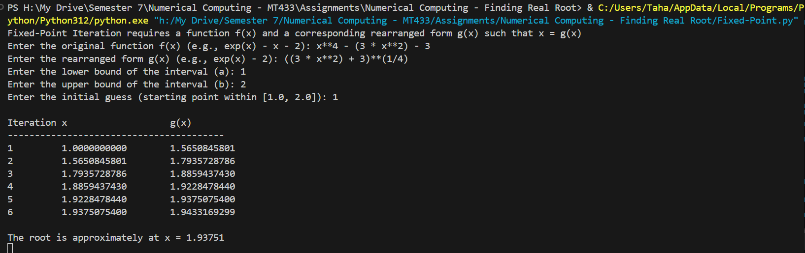
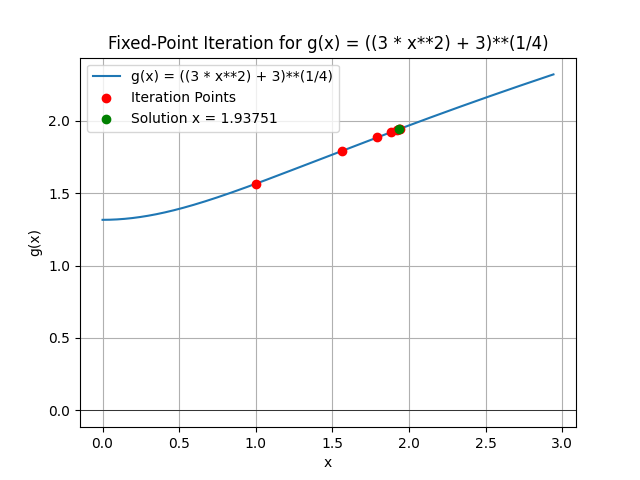

# Numerical Computing - Finding Real Root
It covers:
- Bisection
- Fixed Point 
- Newton-Raphson
- Secant

## Bisection
User can input Function along with their desired Interval


## Newton-Raphson
User can input Function along with their desired Interval




## Secant
User can input Function along with their desired Interval




## Fixed Point

User can input Function along with their desired Interval
Fixed-Point Iteration requires a function f(x) and a corresponding rearranged form g(x) such that x = g(x)




### Note
You can provide all mathematical forms, if not supported update the mapping here, so that code can understand your input ``` f = sp.sympify(func, locals={'log': sp.log, 'sin': sp.sin, 'cos': sp.cos, 'exp': sp.exp, 'tan': sp.tan, 'ln': sp.ln}) ```